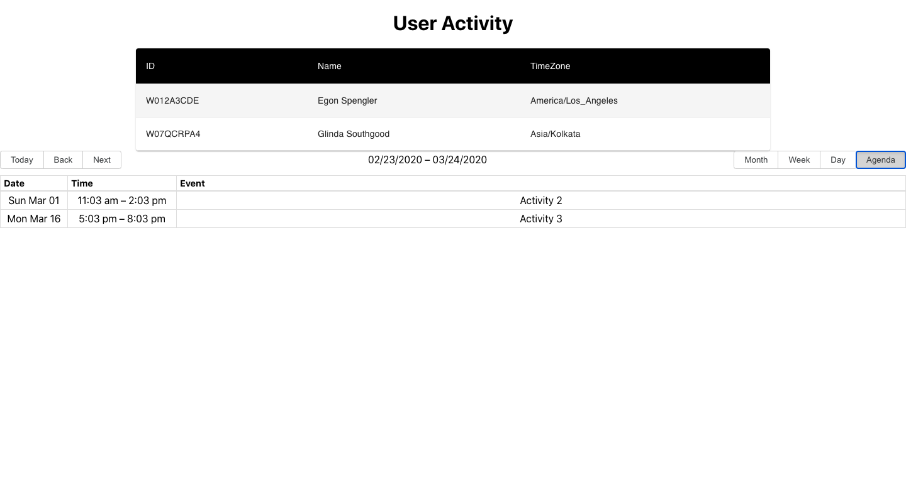
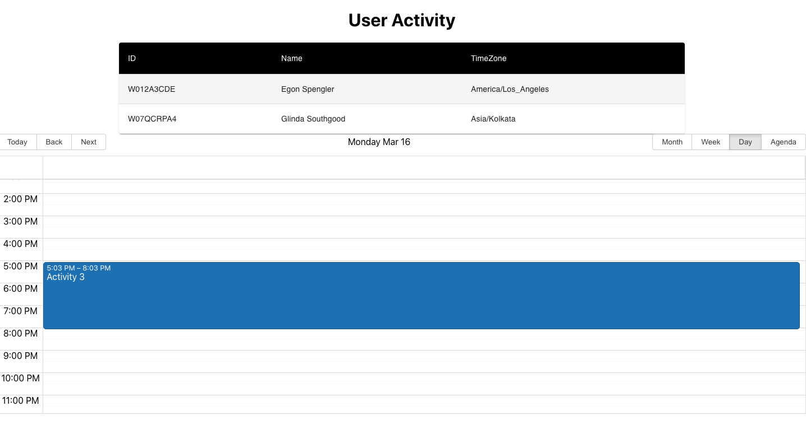

## Introduction 
This is a simple react based application which just takes mock data of two users and display the activities of those users in a calendar. Users are shown in the table component and on clicking a row the modal opens up which shows the list of activities of a user. There is a option of opening the calendar which shows users activity.

## URL 
This application is deployed on Netlify and is available for sometime on this URL[https://elated-tesla-2358a0.netlify.app/]. 

## Some Major packages used are 
1. React-big-Calendar[https://github.com/jquense/react-big-calendar]
2. Moment[https://momentjs.com/]

## Some Screenshots

